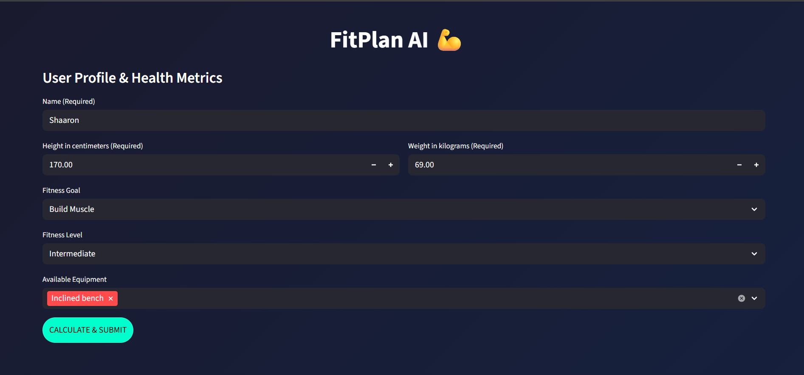
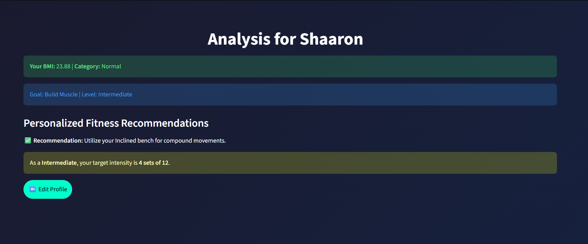

# 💪 FitPlan AI - Milestone 1: User Profile & Health Metrics

## 🎯 Objective
The objective of this milestone was to establish a functional user interface for the FitPlan AI application. This phase involved creating a secure user profile form, implementing health metric calculations, and deploying the initial application structure to a cloud environment.

## 📐 BMI Formula Explanation
The application calculates the Body Mass Index (BMI) using the standard metric formula to determine a user's health category.
The formula implemented is:
BMI = \frac{weight\ (kg)}{height\ (m)^2}

**BMI Health Categories:**
* **Underweight**: BMI < 18.5
* **Normal**: 18.5 ≤ BMI < 24.9
* **Overweight**: 25.0 ≤ BMI < 29.9
* **Obese**: BMI ≥ 30

## 🛠️ Steps Performed
1. **Form Creation**: Built a multi-page Streamlit interface to collect personal data (Name, Height, Weight) and fitness preferences (Goal, Level, Equipment).
2. **Validation**: Added logic to ensure all required fields are filled and numerical inputs are positive before allowing calculation.
3. **BMI Logic**: Created a backend function to process height/weight, round the BMI to 2 decimal places, and provide a categorized analysis.
4. **Deployment**: Organized the project into a professional folder structure and deployed it to Hugging Face Spaces using a Streamlit SDK configuration.

## 💻 Technologies Used
* **Python**: Core logic and data processing.
* **Streamlit**: Web interface and interactive components.
* **GitHub**: Version control and repository management.
* **Hugging Face Spaces**: Cloud hosting and deployment.

## 🚀 Live Application
[View Live App on Hugging Face](https://huggingface.co/spaces/Shaaron2410/AI_Fitness_Plan_Generator)

## 📸 Screenshots

