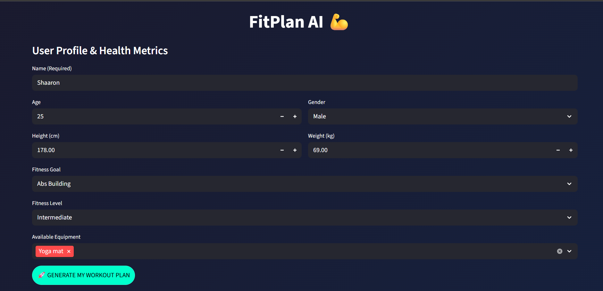
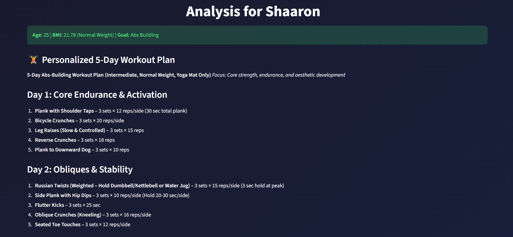
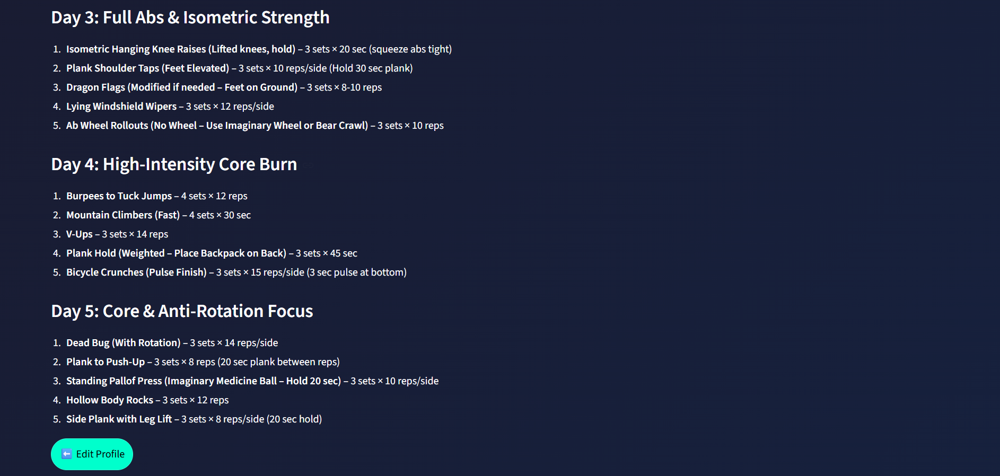

# 💪 FitPlan AI - Milestone 2: Core AI Model Integration

## 🎯 Objective
The objective of this milestone was to integrate a Large Language Model (LLM) into the FitPlan AI application. This phase involved establishing a connection to a high-performance model, designing a structured prompt engineering system, and generating dynamic, personalized workout plans based on the user metrics collected in Milestone 1.

## 🧠 Model Selection
For this phase, the Mistral-7B-Instruct-v0.2 model was selected via the Hugging Face Inference API.
Model Name: mistralai/Mistral-7B-Instruct-v0.2
Why Mistral?
-It offers superior reasoning capabilities and instruction-following compared to smaller encoder-decoder models, ensuring that workout plans are logical, safe, and formatted correctly.

## ✍️ Prompt Design Explanation
The "Secret Sauce" of this application is the Dynamic Prompt Constructor. The prompt is engineered using the following components:
Role Prompting: Instructs the AI to act as a "Certified Professional Fitness Trainer."
Context Injection: Dynamically passes user-specific data (Name, BMI Category, Fitness Goal, Level, and Equipment).
Structured Constraints: Explicitly commands the model to divide the plan into exactly 5 days and forbids medical advice or conversational filler.
Formatting Template: Provides a one-shot example to guide the AI in producing clean, bulleted lists.

## 🛠️ Steps Performed
1.**API Integration**: Configured the HuggingFaceHub Inference Client and implemented secure authentication using HF_TOKEN stored in environment secrets.
2.**Modular Code Structure**: Refactored the application into a clean architecture with separate files for logic (prompt_builder.py), model handling (model.py), and UI (app.py).
3.**Inference Error Handling**: Implemented try-except blocks to handle API timeouts or connection issues gracefully, providing user feedback instead of app crashes.
4.**Dynamic Generation**: Connected the Milestone 1 BMI logic to the LLM to adjust workout intensity (e.g., lower impact exercises for higher BMI categories).
5.**Enhanced Deployment**: Re-deployed the updated code to Hugging Face Spaces with the necessary secrets and dependencies.

## 💻 Technologies Used
1. **Inference Client**: For high-speed, serverless LLM calls.
2. **PyTorch**: Underlying tensor management for model interactions.
3. **Accelerate**: Optimized model loading and memory management.
4. **Streamlit**: Updated to handle multi-page session states and markdown rendering.

## 🚀 Live Application
[View Live App on Hugging Face](https://huggingface.co/spaces/Shaaron2410/AI_Fitness_Plan_Generator_Dup)

## 📸 Screenshots

