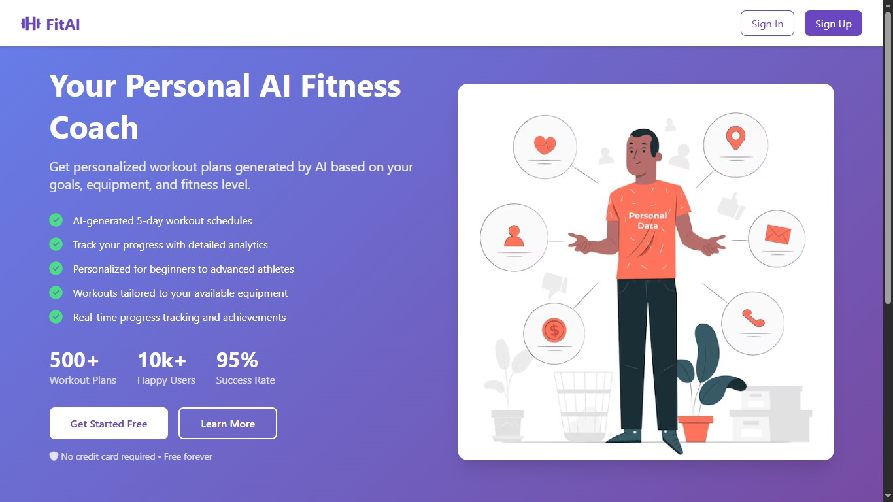
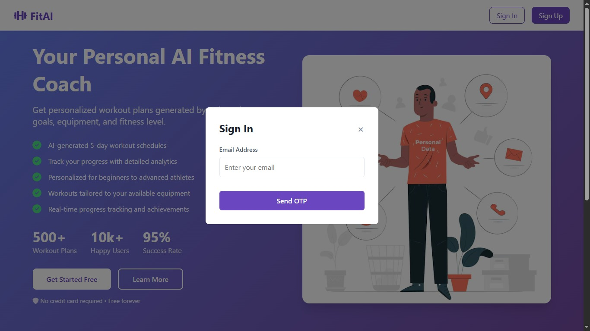
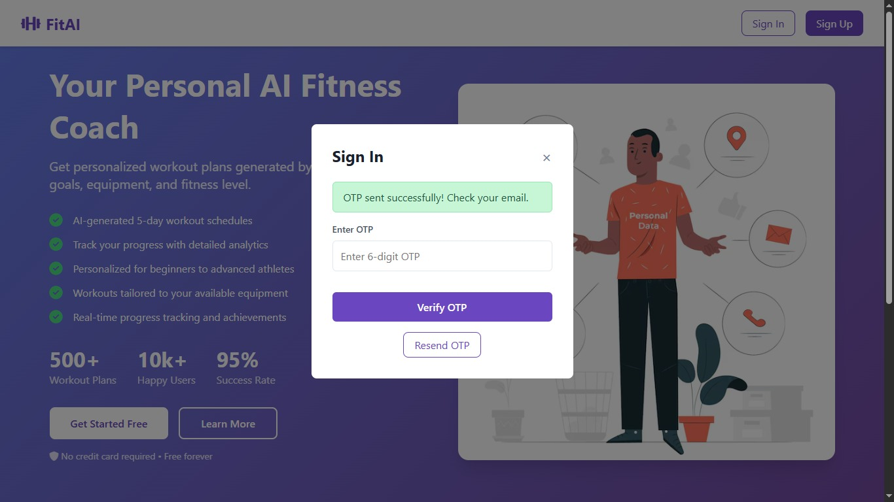
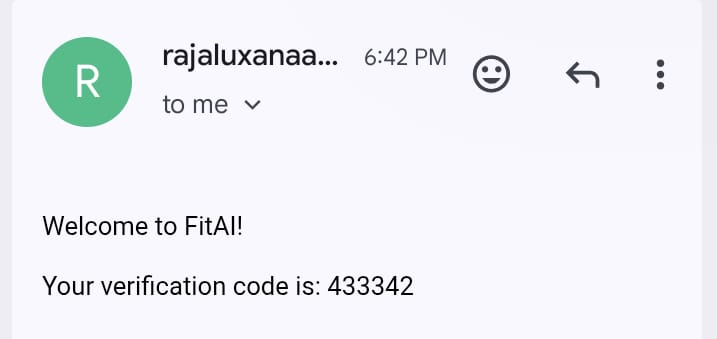
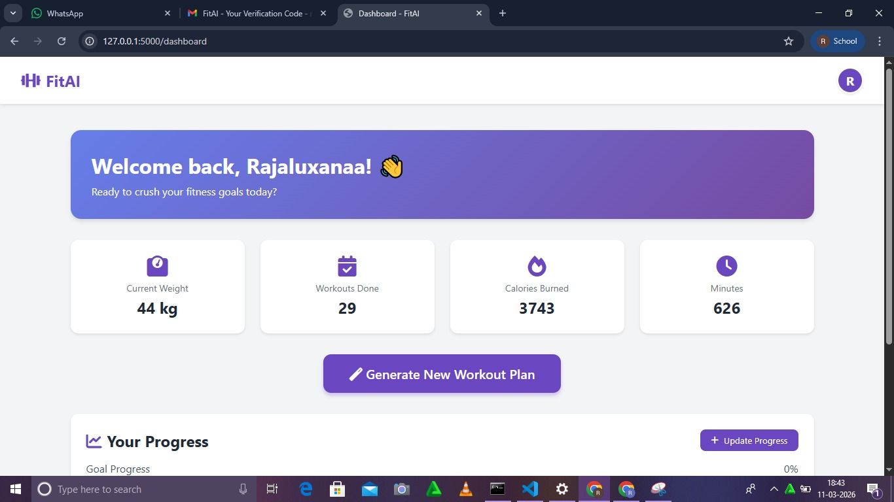

# 💪 FitPlan-AI - Milestone 3: Secure Authentication System

## 🎯 Objective
The objective of this milestone was to implement a robust, secure authentication and user verification system. This phase focused on transitioning from basic access to a professional-grade login flow, incorporating password security, session management, and Multi-Factor Authentication (MFA) via OTP.

## 🧠 Security & Auth Architecture
For this phase, a secure backend architecture was implemented using Flask and industry-standard security practices.
1. **Password Security**: Passwords are never stored in plain text. We implemented SHA-256 Hashing with dynamic salt, ensuring that even if the database is compromised, individual passwords remain protected.
2. **Session Management**: Utilized Flask-Session to securely track logged-in users, preventing unauthorized access to the dashboard.
3. **OTP Verification**: Implemented a time-sensitive verification step using SendGrid API to ensure that only the owner of the registered email address can access the account.

## ✍️ Implementation Logic
The authentication logic is divided into modular components to ensure maintainability:
1. **Credential Hashing (auth.py)**: Uses hashlib to generate unique salts for every user, making rainbow table attacks ineffective.
2. **Database Schema (database.py)**: Built on SQLAlchemy, the User model stores credentials and tracks account creation timestamps securely.
3. **Email Relay (email_utils.py)**: Interfaces with the SendGrid API to deliver reliable, high-delivery-rate verification codes.
4. **Route Protection (app.py)**: Uses server-side session checks to ensure the /dashboard route is inaccessible without a successful OTP verification.

## 🛠️ Steps Performed
1. **Backend Development**: Built the Flask application structure with separated concerns for auth, database, and email utilities.
2. **Security Hardening**: Implemented salted hashing to protect user credentials at rest.
3. **MFA Integration**: Integrated SendGrid to handle transactional email delivery for OTPs.
4. **Session Control**: Engineered the login flow to mandate OTP validation before establishing a user session.
5. **Deployment**: Deployed the production-ready Flask application to render.com for public access.

## 💻 Technologies Used
1. **Flask 2.3.0**: Lightweight web framework for handling routing and sessions.
2. **SQLAlchemy 3.0.0**: ORM for secure database interaction.
3. **SendGrid API**: High-reliability email delivery service for OTPs.
4. **SHA-256 with Salt**: Standard cryptographic hashing for credential protection.
5. **Render.com**: Cloud platform for hosting the backend application.

## 🚀 Live Application
🔗 [View Live App](https://fitness-ai-dsgq.onrender.com)

## 📸 Screenshots

