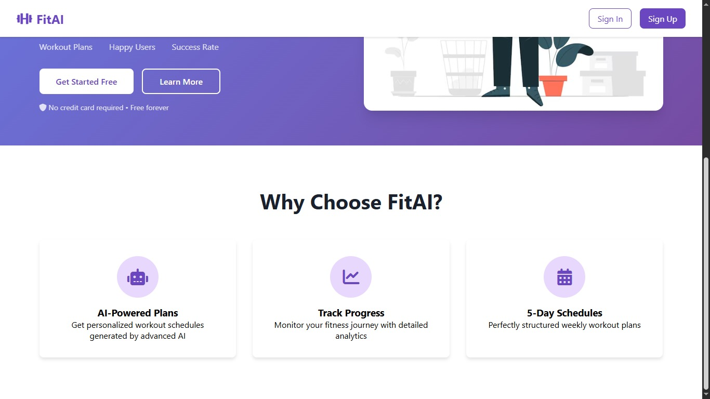
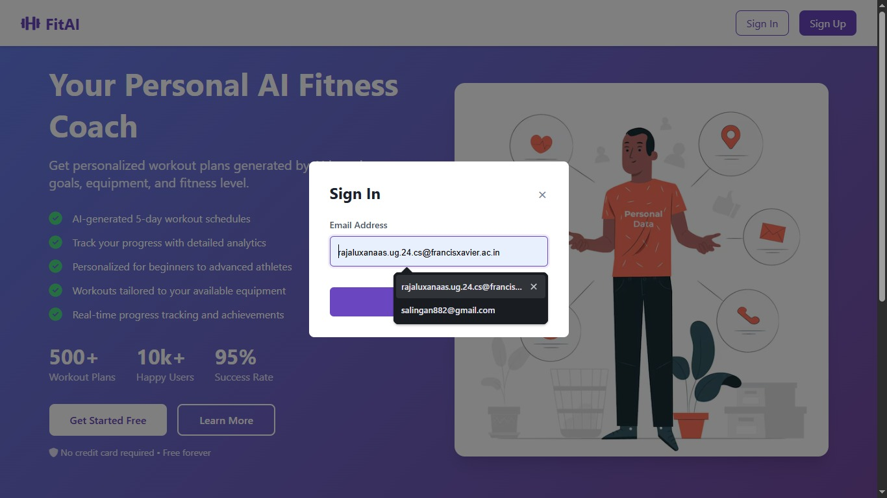

# 💪 FitPlan-AI - Milestone 4: Application Finalization & Deployment

## 🎯 Objective
The objective of this final milestone was to transition FitPlan AI from a prototype to a production-ready application. This phase focused on Input Validation, Graceful Error Handling, AI Reliability, and UI/UX Optimization to ensure a seamless and safe user experience before final deployment.

## 🧠 System Architecture & Reliability
For the final phase, the architecture was hardened to handle real-world edge cases and potential API failures.
1. **Multi-Layer Validation**: Implemented strict server-side validation for all biometric inputs (Age, Weight, Height) to ensure the AI generates medically safe and logical workout plans.
2. **AI Fallback System**:To guarantee 100% uptime, a hierarchy of models (Llama 3.3, Llama 3.1, and Gemma 2) was implemented via the Groq API. If all external APIs fail, the system automatically triggers a high-quality Hard-coded Recovery Template.
3. **Enhanced Security**:Integrated Flask-Limiter to provide rate limiting on sensitive endpoints (OTP/Signup), preventing brute-force attacks and resource exhaustion.

## ✍️ Implementation Logic
The application logic was modularized into specialized components to meet professional development standards:
1. **Input Sanitization (app.py)**: Uses Regex and range-checking functions to validate emails and biometric data before they reach the database or AI.
2. **Reliable Generation (model_api.py)**: Features a "Retry & Fallback" logic that monitors AI response quality (checking for "DAY 5" and minimum length) before saving the plan.
3. **Data Persistence (database.py)**: Expanded the SQLAlchemy models to include WorkoutSchedule for saving history and ErrorLog for production monitoring.
4. **Email Optimization (email_utils.py)**: Integrated SendGrid with improved error logging to ensure high delivery rates for 6-digit verification codes.

## 🛠️ Steps Performed
1. **Validation Hardening**: Engineered 6 distinct validation functions to catch invalid user data at the entry point.
2. **UI/UX Refinement**: Optimized the dashboard navigation and improved the readability of the AI-generated 5-day workout plans.
3. **MFA Lifecycle Management**: Implemented a 10-minute expiry window for OTPs and added "Resend OTP" functionality with rate-limiting protection.
4. **Error Handling**: Added try-except blocks across all API calls to catch "Unexpected Outputs" and log them for debugging.
5. **Final Deployment**: Optimized the requirements.txt and Gunicorn configuration for a stable final deployment on Render.com.

## 💻 Technologies Used
1. **Flask-Limiter 3.3.1**: To prevent API abuse through rate limiting.
2. **Groq API & Llama-3.3**: High-performance LLM integration for personalized plan generation.
3. **SendGrid API**: Robust transactional email delivery for the verification flow.
4. **SQLAlchemy 2.0**: Advanced ORM for managing user profiles and workout history.
5. **Gunicorn 20.1**: Production-grade WSGI server for the final deployment.

## 🚀 Live Application
🔗 [View Live App](https://fitness-ai-dsgq.onrender.com)

## 📸 Screenshots

